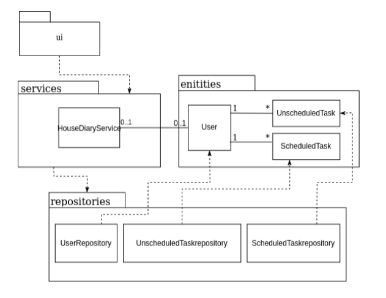
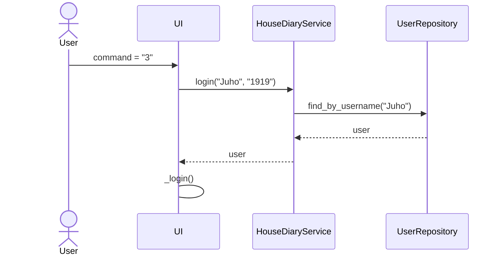
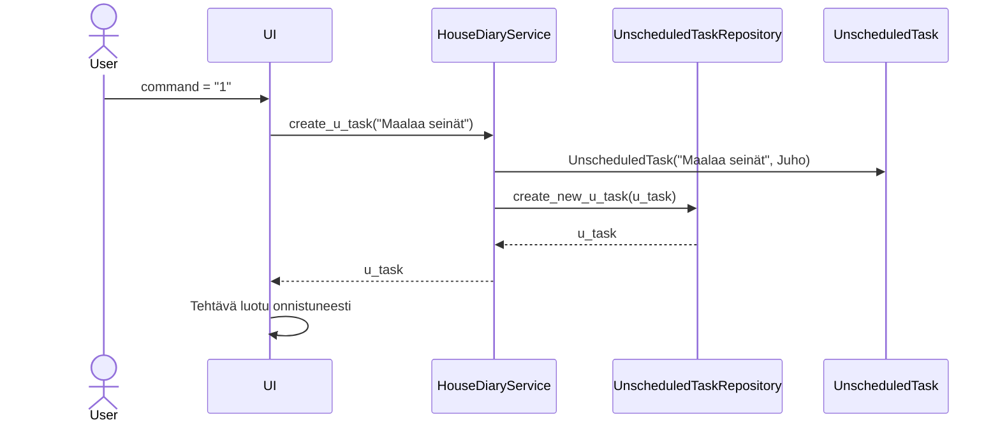

# Arkkitehtuurikuvaus

## Sovelluslogiikka

Pakkausrakenne ja luokat:

## Päätoiminnalisuudet

### Kirjautuminen

Käyttäjä on jo luonut tunnuksen ja salasanan. Käyttäjä antaa komennon 3. Sovellus etenee tästä seuraavanlaisesti:

Käyttäjä kirjoittaa käyttäjätunnuksensa ja salasanansa, minkä jälkeen käyttöliittymä pyytää HouseDiaryService-palvelulta kirjautumista. Tämä palvelu tarkistaa UserRepositoryn avulla, ovatko annetut tunnus ja salasana oikein. Mikäli kirjautuminen onnistuu, HouseDiaryService välittää käyttäjätiedot takaisin käyttöliittymään, joka päivittyy näyttämään kirjautumisen jälkeisen käyttöliittymän.

### Aikatauluttoman tehtävän luominen

Kun käyttäjä on kirjautunut sisään ja valinnut komennon 1, sovellus toimii seuraavasti:

UnscheduledTask saa myös muita tietoja, kuten luontiajan, muita tietoja ei tässä yhteydessä käsitellä tarkemmin. Kun tehtävä on onnistuneesti luotu, käyttöliittymä ilmoittaa tästä käyttäjälle ja päivittää tehtävälistan, kun käyttäjä antaa asianmukaisen komennon.
