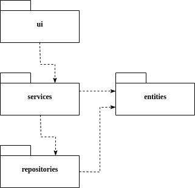
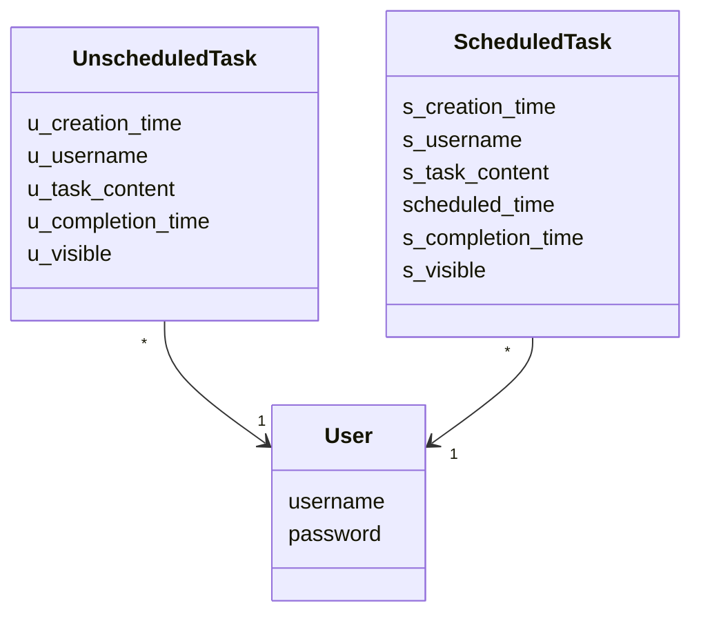
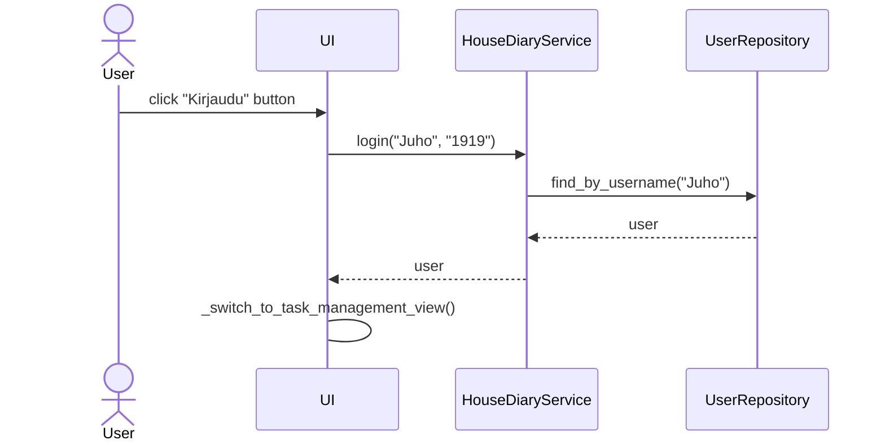
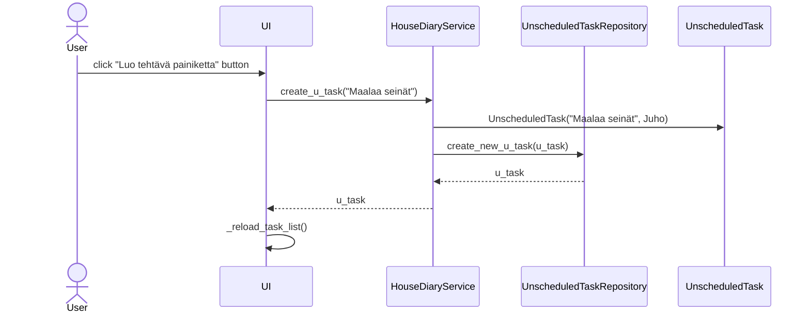

# Arkkitehtuurikuvaus

## Rakenne

Ohjelman arkkitehtuuri on suunniteltu noudattamaan kolmitasoista kerrosarkkitehtuuria, ja sen koodi on jaettu seuraaviin osiin:

- ui: Tämä pakkaus sisältää kaikki käyttöliittymään liittyvät komponentit ja näkymät.
- services: Tässä paketissa on sovelluksen keskeinen logiikka, kuten käyttäjien hallinta ja tehtävien käsittely.
- repositories: Tämä osio vastaa tietojen tallentamisesta tietokantoihin.
- entities: Sisältää luokat, jotka mallintavat sovelluksessa käytettäviä tietoja, kuten käyttäjät ja tehtävät.

Tämä rakenne mahdollistaa selkeän erottelun käyttöliittymän, sovelluslogiikan ja tietovarastoinnin välillä, mikä helpottaa ylläpitoa ja mahdollisia laajennuksia tulevaisuudessa.

## Käyttöliittymä

Käyttöliittymä koostuu viidestä eri näkymästä, jotka on kunkin toteutettu omassa luokassaan. Nämä näkymät ovat:

- Uuden käyttäjän luominen: Käyttäjät voivat luoda uuden käyttäjätilin.
- Kirjautuminen: Käyttäjät kirjautuvat sovellukseen.
- Etusivu: Tarjoaa näkymän käyttäjän avoimista tehtävistä, mahdollistaa uusien tehtävien lisäämisen, olemassaolevien tehtävien merkitsemisen valmiiksi sekä siirtymisen tehtyjen tehtävien listaukseen.
- Tehdyt tehtävät: Erilliset sivut aikataulutetuille ja aikatauluttomille tehtäville, näyttää suoritetut tehtävät ja mahdollistaa niiden poistamisen.

Näistä näkymistä vain yksi on kerrallaan aktiivinen ja näkyvissä. Näkymien hallinnasta vastaa [UI](../src/ui/ui.py)-luokka. Käyttöliittymä on suunniteltu siten, että se on erillään sovelluslogiikasta, eli se ei sisällä logiikkatoimintoja, vaan kutsuu HouseDiaryService-luokan metodeja tarpeen mukaan. 

## Sovelluslogiikka

Sovelluksen tietorakennetta kuvastavat [User](https://github.com/RGH84/ot-harkkatyo/blob/master/housediary/src/entities/user.py), [UnscheduledTask](https://github.com/RGH84/ot-harkkatyo/blob/master/housediary/src/entities/task_manager.py) ja [ScheduledTask](https://github.com/RGH84/ot-harkkatyo/blob/master/housediary/src/entities/task_manager.py)-luokat, jotka kuvaavat käyttäjiä ja käyttäjien tehtäviä:

Sovelluksen toiminnasta vastaa [HouseDiaryService](https://github.com/RGH84/ot-harkkatyo/blob/master/housediary/src/services/house_diary_service.py)-luokka. Tämä luokka tarjoaa metodit kaikille käyttöliittymän toiminnoille, kuten:

- login(username, password): Kirjaa käyttäjän sisään.
- get_u_undone_taks(): Hakee suorittamattomat aikatauluttomat tehtävät.
- create_u_task(u_task_content): Luo uuden aikatauluttoman tehtävän.
- mark_u_undone_done(task_id): Merkitsee aikatauluttoman tehtävän tehdyksi.

HouseDiaryService hyödyntää käyttäjien ja tehtävien tietoja, joihin se pääsee käsiksi repositories-pakkauksessa sijaitsevien UnscheduledTaskRepository, ScheduledTaskRepository ja UserRepository -luokkien avulla.

Sovelluksen rakenteellisia suhteita kuvaava luokka- ja pakkauskaavio esittelee, miten HouseDiaryService toimii muiden ohjelman osien kanssa:

## Tietojen pysyväistallennus

Pakkauksen _repositories_ luokat `UnscheduledTaskRepository`, `ScheduledTaskRepository` ja `UserRepository` huolehtivat tietojen tallettamisesta. Nämä luokat tallentavat tietoa SQLite-tietokantaan.

### Tiedostot

Sovellus tallettaa käyttäjien ja tehtävien tiedot samaan tietokantaan.

Sovelluksen juureen sijoitettu [konfiguraatiotiedosto](./kayttoohje.md#konfiguraatiotiedosto) [.env](https://github.com/RGH84/ot-harkkatyo/blob/master/housediary/.env) määrittelee tiedostojen nimet.

Käyttäjät tallennetaan SQLite-tietokannan tauluun `users`, aikatauluttomat tehtävät tauluun `unscheduled_tasks_table` ja aikataululliset tehtävät tauluun `scheduled_tasks_table`. Talut alustetaan [initialize_database.py](https://github.com/RGH84/ot-harkkatyo/blob/master/housediary/src/initialize_database.py)-tiedoston kautta.

Testeille käytetään omaa tietokantaa. Testitietokanta käyttää myös [konfiguraatiotiedosto](./kayttoohje.md#konfiguraatiotiedosto) [.env](https://github.com/RGH84/ot-harkkatyo/blob/master/housediary/.env), jolla voi määritellä testitietokannan nimen. Testitietokanta alustetaan [test_initialize_database.py](https://github.com/RGH84/ot-harkkatyo/blob/master/housediary/src/test_initialize_database.py)-tiedoston kautta.

Molemmat tietokannat käyttävät yhteistä [dadabase_operation.py](https://github.com/RGH84/ot-harkkatyo/blob/master/housediary/src/database_operations.py)-tiedostoa alustamiseen, jonka avulla taulut pysyvät samana molemmissa tietokannoissa.

## Päätoiminnalisuudet

### Kirjautuminen

Käyttäjä on jo luonut tunnuksen ja salasanan. Käyttäjä kirjoitaa oikean tunnuksen ja salasanan syötekenttiin, sovellus etenee tästä seuraavanlaisesti:

Käyttäjä kirjoittaa käyttäjätunnuksensa ja salasanansa, minkä jälkeen käyttöliittymä pyytää HouseDiaryService-palvelulta kirjautumista. Tämä palvelu tarkistaa UserRepositoryn avulla, ovatko annetut tunnus ja salasana oikein. Mikäli kirjautuminen onnistuu, HouseDiaryService välittää käyttäjätiedot takaisin käyttöliittymään, joka päivittyy näyttämään kirjautumisen jälkeisen käyttöliittymän.

### Aikatauluttoman tehtävän luominen

Kun käyttäjä on kirjautunut sisään ja klikkaa Luo aikatauluttomaton tehtävä painiketta, sovellus toimii seuraavasti:

UnscheduledTask saa myös muita tietoja, kuten luontiajan, muita tietoja ei tässä yhteydessä käsitellä tarkemmin. Kun tehtävä on onnistuneesti luotu, käyttöliittymä ilmoittaa tästä käyttäjälle ja päivittää tehtävälistan.

### Muut toiminnallisuudet

Kaikissa sovelluksen toiminnallisuuksissa noudatetaan samaa periaatetta: käyttöliittymän tapahtumakäsittelijä kutsuu sopivaa sovelluslogiikan metodia, joka päivittää tehtävien tai kirjautuneen käyttäjän tilaa. Kun ohjaus palaa käyttöliittymään, päivitetään tarvittaessa tehtävälista ja aktiivinen näkymä.

### Ohjelman rakenteeseen jääneet heikkoudet

- Käyttöliittymä voisi parantaa käytettävyyden ja selkeyden osalta
- Liian pitkiä syötteitä ei valvota 

