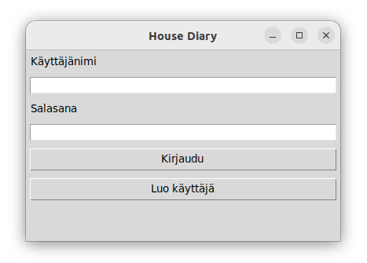
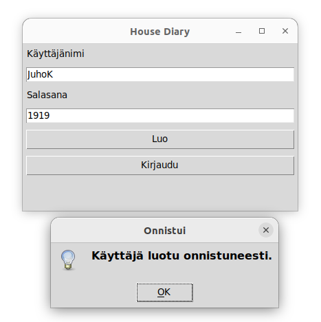
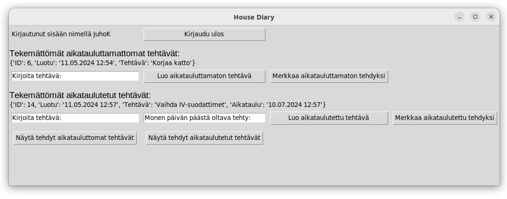
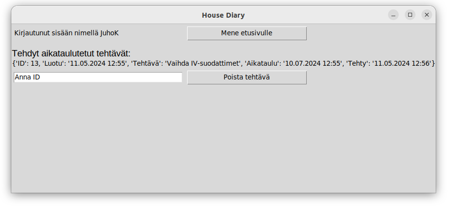

# Käyttöohje

Voit ladata projektin uusimman version lähdekoodin suoraan GitHubista. Siirry projektin [releases](https://github.com/RGH84/ot-harkkatyo/releases/tag/viikko6)-sivulle ja valitse Assets-kohdasta Source code ladataksesi tiedostot.

## Konfigurointi

Voit määrittää tallennettavien tiedostojen nimet haluamallasi tavalla käyttämällä .env-tiedostoa käynnistyshakemistossa. Jos tiedostoja ei vielä ole data-hakemistossa, ne luodaan automaattisesti sinne. Tiedostojen muoto on seuraava:

```
DATABASE_FILENAME=database.sqlite
TEST_DATABASE_FILENAME=test_database.sqlite
```

## Ohjelman asennus ja käynnistäminen

1. Kloonattuasi tämän projektin, mene hakemistoon housediary komennolla:
   
```bash
cd housediary
```

2. Asenna tarvittavat riippuvuudet suorittamalla seuraava komento:

```bash
poetry install
```

3. Tee tarpeelliset alustavat toimenpiteet käyttämällä komentoa:

```bash
poetry run invoke build
```

4. Käynnistä sovellus antamalla komento:

```bash
poetry run invoke start
```

## Kirjautuminen

Sovellus avautuu suoraan kirjautumisnäkymään:



Kirjautua voit syöttämällä voimassa olevan käyttäjätunnuksen ja salasanan vastaaviin kenttiin ja klikkaamalla "Kirjaudu"-painiketta.

## Uuden käyttäjän luominen

Voit siirtyä kirjautumisnäkymästä uuden käyttäjän luontinäkymään napsauttamalla "Luo käyttäjä" -painiketta.

Luo uusi käyttäjäprofiili täyttämällä vaaditut tiedot ja painamalla "Luo"-painiketta:



Onnistuneen rekisteröinnin jälkeen ohjelma palauttaa sinut kirjautumisnäkymään.

## Etusivu

Kirjautumisen jälkeen pääset etusivulle, joka esittelee kaikki keskeneräiset tehtäväsi:



Tässä näkymässä voit lisätä uusia tehtäviä, merkitä olemassaolevia tehtäviä valmiiksi sekä tarkastella suoritettuja tehtäviä.

## Tehdyt tehtävät

Aikataulutetuille ja aikatauluttomille tehtäville on omat näkymänsä, joissa voit tarkastella valmiita tehtäviä ja poistaa niitä tarpeen mukaan.



