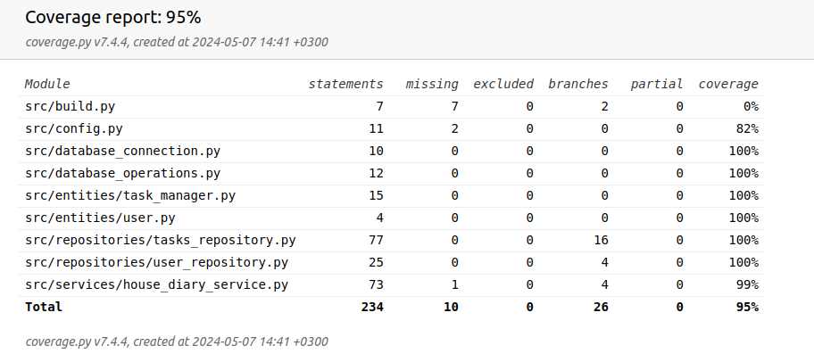

# Testausdokumentti

Ohjelman toimintaa on varmistettu käyttämällä automatisoituja yksikkö- ja integraatiotestejä unittest-työkalulla sekä suorittamalla manuaalisia järjestelmätesteja.

## Yksikkö- ja integraatiotestaus

### Sovelluslogiikka ja repositorio-luokat

Sovelluslogiikasta vastaavaa HouseDiaryService-luokkaa testataan käyttämällä [TestHouseDiaryService](https://github.com/RGH84/ot-harkkatyo/blob/master/housediary/src/tests/house_diary_service_test.py)-testiluokkaa. Tämä testiluokka käyttää erillistä testitietokantaa, joka alustetaan ennen jokaista testiä vastaamaan tuotantokäytössä olevan tietokannan rakennetta.

Testeissä HouseDiaryService-luokka suorittaa erilaisia toimintoja, jotka välitetään edelleen sovelluksen repositorioille. Tämä prosessi varmistaa, että sekä HouseDiaryService että sen alaiset repositoriot toimivat odotetulla tavalla.

### Testauskattavuus

Käyttöliittymäkerrosta ja tietokantojen alustusta ei testattu lainkaan. Muille osa-alueille testien haaraumakattavuus saavutti 95 %

Tiedostot build.py ja config.py jäivät testaamatta. Niiden toimintaa ei sisällytetty testikattavuuteen, sillä niiden toimivuus on varmistettu manuaalisesti.

## Järjestelmätestaus

Sovelluksen järjestelmätason testaus on tehty manuaalisesti.

### Asennus ja konfigurointi

Sovellus on ladattu ja testattu manuaalisesti [käyttöohjeessa](./kayttoohje.md) kuvatulla tavalla, käyttäen Ubuntu 22.04.4 LTS ja Cubbli Linux -käyttöjärjestelmiä. Testauksessa on hyödynnetty myös erilaisia asetuksia .env-tiedoston avulla.

Testit on suoritettu sekä tilanteissa, joissa käyttäjien ja työtehtävien tiedostot ovat jo olleet olemassa että tilanteissa, joissa näitä tiedostoja ei ole ollut, jolloin sovellus on luonut ne automaattisesti.

### Toiminnallisuudet

Kaikki [määrittelydokumentissä](./vaatimusmaarittely.md#perusversion-tarjoama-toiminnallisuus) ja käyttöohjeessa listatut toiminnallisuudet on testattu. Esim. käyttöliittymä estää tyhjien arvojen syöttämisen syötekenttiin.

## Sovellukseen jääneet laatuongelmat

Tällä hetkellä sovellus ei tarjoa selkeitä virheilmoituksia seuraavissa tilanteissa:

- Päivittyy
