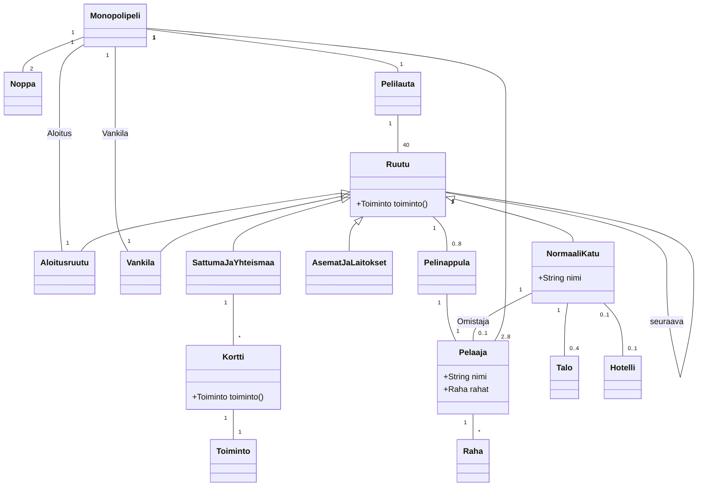

```mermaid
 classDiagram
    Monopolipeli "1" -- "2" Noppa
    Monopolipeli "1" -- "1" Pelilauta
    Monopolipeli "1" -- "1" Aloitusruutu : Aloitus
    Monopolipeli "1" -- "1" Vankila : Vankila
    Pelilauta "1" -- "40" Ruutu
    Ruutu <|-- Aloitusruutu
    Ruutu <|-- Vankila
    Ruutu <|-- SattumaJaYhteismaa
    Ruutu <|-- AsematJaLaitokset
    Ruutu <|-- NormaaliKatu
    Ruutu "1" -- "1" Ruutu : seuraava
    Ruutu "1" -- "0..8" Pelinappula
    Pelinappula "1" -- "1" Pelaaja
    Pelaaja "2..8" -- "1" Monopolipeli
    SattumaJaYhteismaa "1" -- "*" Kortti
    Kortti "1" -- "1" Toiminto
    NormaaliKatu "1" -- "0..4" Talo
    NormaaliKatu "0..1" -- "0..1" Hotelli
    NormaaliKatu "1" -- "0..1" Pelaaja : Omistaja
    Pelaaja "1" -- "*" Raha

    class Ruutu{
        +Toiminto toiminto()
    }

    class Aloitusruutu{
    }

    class Vankila{
    }

    class SattumaJaYhteismaa{
    }

    class AsematJaLaitokset{
    }

    class NormaaliKatu{
        +String nimi
    }

    class Kortti{
        +Toiminto toiminto()
    }

    class Toiminto{
    }

    class Talo{
    }

    class Hotelli{
    }

    class Pelaaja{
        +String nimi
        +Raha rahat
    }

    class Raha{
    }

    class Noppa{
    }

    class Pelilauta{
    }

    class Pelinappula{
    }
```
