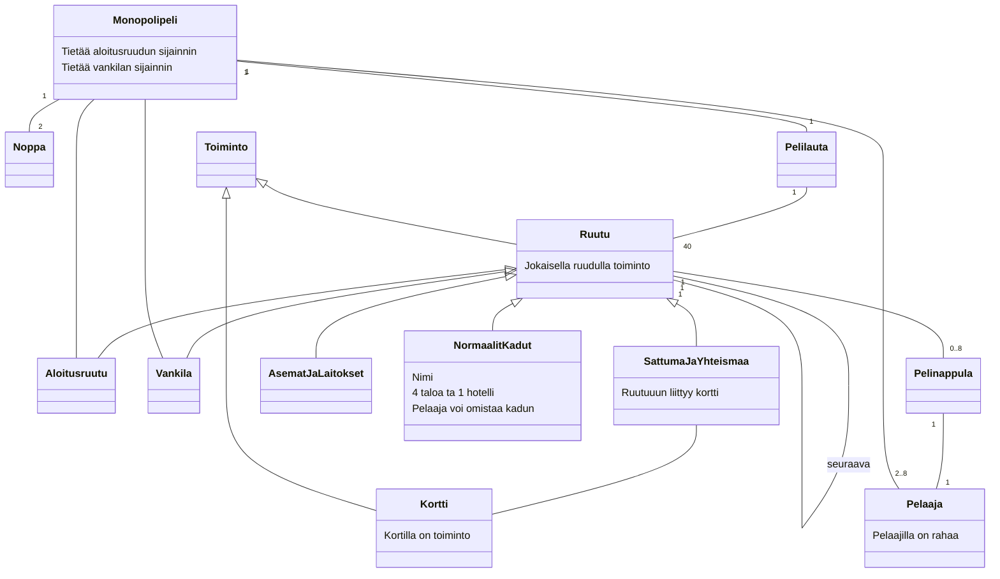

```mermaid
 classDiagram
    Monopolipeli "1" -- "2" Noppa
    Monopolipeli "1" -- "1" Pelilauta
    Pelilauta "1" -- "40" Ruutu
    Ruutu <|-- Aloitusruutu
    Ruutu <|-- Vankila
    Ruutu <|-- SattumaJaYhteismaa
    Ruutu <|-- AsematJaLaitokset
    Ruutu <|-- NormaalitKadut
    Ruutu "1" -- "1" Ruutu : seuraava
    Ruutu "1" -- "0..8" Pelinappula
    Pelinappula "1" -- "1" Pelaaja
    Pelaaja "2..8" -- "1" Monopolipeli
    Monopolipeli -- Aloitusruutu
    Monopolipeli -- Vankila
    SattumaJaYhteismaa -- Kortti
    Toiminto <|-- Ruutu
    Toiminto <|-- Kortti

   class Monopolipeli {
        Tietää aloitusruudun sijainnin
        Tietää vankilan sijainnin
    }
    
    class Ruutu {
        Jokaisella ruudulla toiminto
    }

    class SattumaJaYhteismaa {
        Ruutuuun liittyy kortti
    }

    class NormaalitKadut {
        Nimi
        4 taloa ta 1 hotelli
        Pelaaja voi omistaa kadun
    }

    class Pelaaja {
        Pelaajilla on rahaa
    }

    class Kortti {
        Kortilla on toiminto
    }
```
